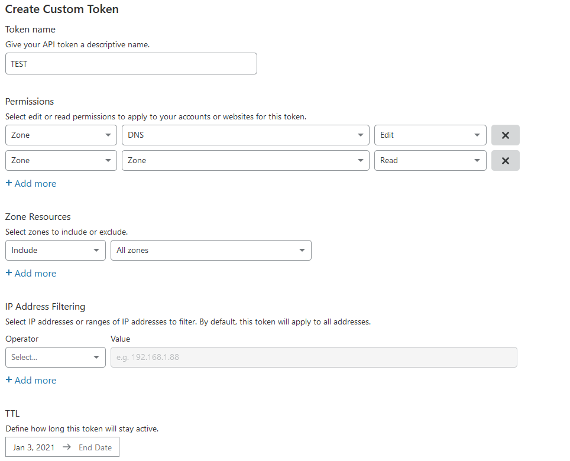

# API Key

CUP requires a cloudflare API key to update your DNS records. Here, you'll find information on how to create that key.

## Creation

- Log in to your Cloudflare dashboard.
- Click the account menu in the upper-right corner
- Click "My Profile"
- Select the "API Tokens" tab
- Select "Create Token"
- Select "Get Started" on the "Create Custom Token" option at the bottom
- Generate a token with the below settings.
- Select "Continue to Summary"
- Select "Create Token"
- Save this token somewhere safe!
  - Treat it like a password
  - Cloudflare won't show it to you again
    
## Permissions

### Explanation

#### Permissions

Zone - DNS - Edit: Required to update DNS records
Zone - Zone - Read: Required to list the domains you control in Cloudflare to get their API ID

#### Zone Resources
Include - All zones: Required to be able to list the domains you control. 

NOTE: You can't restrict this beyond All Zones due to what many would perceive as a long-standing bug in the Cloudflare API.  
If you select just the domains you wish to update, the list action on the API fails, even if querying against just that domain.

